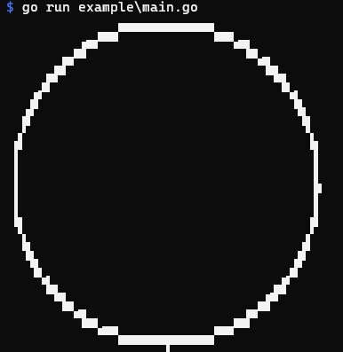

go-unicodesemigraphics
======================

```go
package main

import (
    "fmt"
    "math"

    "github.com/zetamatta/go-unicodesemigraphics"
)

func main() {
    bmp := unicodesemigraphics.NewBitmap(80, 40)

    for theta := 0.0; theta < 360; theta += 1 {
        x := 40.0 + 38.0*math.Cos(theta*math.Pi/180)
        y := 20.0 + 19.0*math.Sin(theta*math.Pi/180)
        bmp.Set(int(x), int(y), true)
    }
    fmt.Println(bmp.String())
}
```


